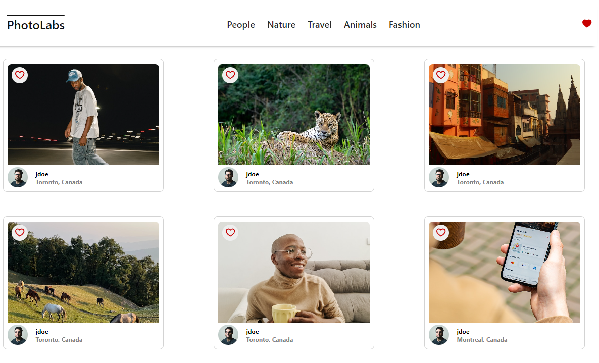
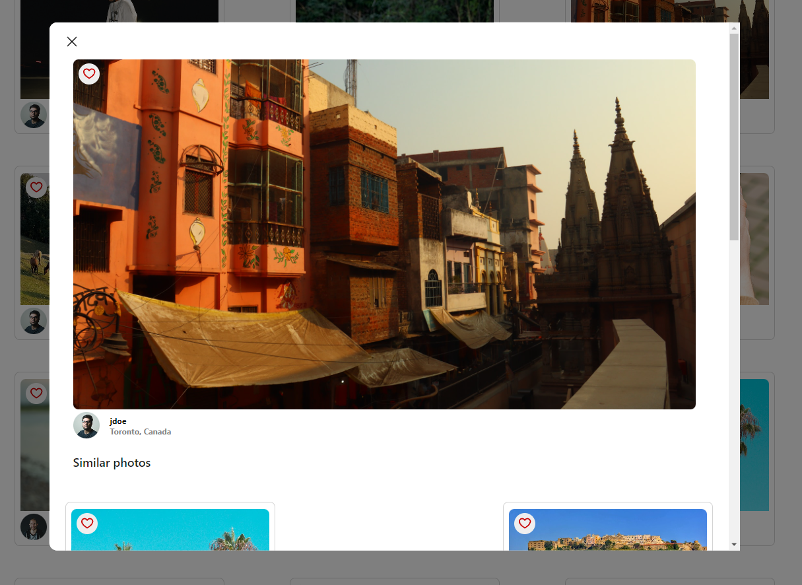

# React - Photolabs
A Photo library React-based single page app. You can filter the photos by topics and see more information of a photo in a separate modal

# Dependencies
- React
- Create-react-app
- Express
- pg

# Screenshots




## Setup

Install dependencies with `npm install` in each respective `/frontend` and `/backend`.

## [Frontend] Running Webpack Development Server

```sh
cd frontend
npm start
```

## [Backend] Running Backend Servier

Read `backend/readme` for further setup details.

```sh
cd backend
npm start
```
